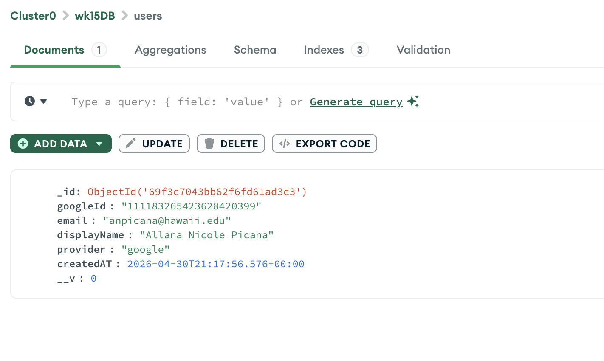

# Week 15 - HW15A: Google OAuth 2.0 

## Reflection:
Google OAuth made login so much easier because my web app no longer have to handle passwords anymore. I didn’t need to build a “sign up” page, make password rules, store passwords in MongoDB, or check passwords when someone logs in. Instead Google handles the sign-in part, and my app only receives the user’s basic info (email and name) through Passport.js. This saved time and reduced the chance of making mistakes with password security.

However, it also added new things I had to set up. I had to create a Google OAuth client, use the correct callback URL, and keep my Client Secret safe in a .env file. I also had to use sessions so the user stays logged in, and save the user in MongoDB using googleId.

Personally, I think it also invites users who may need an account or create an account with ease and peace of mind, since they can simply use their existing Google account to sign in securely and won't have to go through a possibly lengthy way of signing up.

## Screenshots:
- Google sonsent screen with app name visisble:

- Google sonsent screen with app name visisble:

- Google sonsent screen with app name visisble:

### AI tools used:
- ChatGPT: Debugged 'connect-mongo' and session setup, help generate simple ejs templates for home.ejs and profle.ejs, fixed .env issues with MONGO_URI and SESSION_SECRET, and Mongoose validation error ('provider required' error).